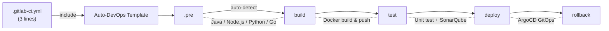
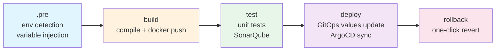
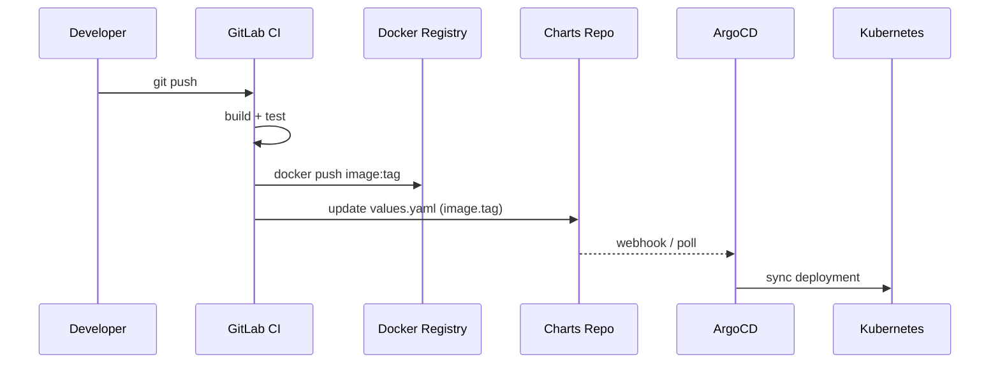

# gitlab-ci-templates

> Drop-in CI/CD for GitLab. One `include`, full pipeline -- build, test, scan, deploy.

English | [中文](README.zh-CN.md)

[](https://opensource.org/licenses/MIT)
[](https://github.com/cdryzun/gitlab-ci-templates/actions/workflows/ci.yml)
[](https://github.com/cdryzun/gitlab-ci-templates/actions/workflows/build-images.yml)
[](https://github.com/cdryzun?tab=packages)
[](https://github.com/cdryzun/gitlab-ci-templates/stargazers)

---

**Get a production-grade CI/CD pipeline in 3 lines of YAML.**
Auto-detects Java, Node.js, Python, and Golang. Batteries included: Docker builds, SonarQube, ArgoCD GitOps, secret scanning, and rollback support.



---

## Before / After

<table>
<tr><th>Without this template (200+ lines)</th><th>With this template (6 lines)</th></tr>
<tr>
<td>

```yaml
stages:
  - build
  - test
  - docker
  - deploy

variables:
  MAVEN_OPTS: "-Dmaven.repo.local=.m2"

build:
  stage: build
  image: maven:3.9-eclipse-temurin-17
  script:
    - mvn clean package -DskipTests
  artifacts:
    paths: [target/]

test:
  stage: test
  image: maven:3.9-eclipse-temurin-17
  script:
    - mvn test

docker:
  stage: docker
  image: docker:24
  services: [docker:24-dind]
  script:
    - docker build -t $IMAGE .
    - docker push $IMAGE

# ... 150 more lines for deploy,
# rollback, scanning, caching...
```

</td>
<td>

```yaml
include:
  - remote: 'https://raw.githubusercontent.com/cdryzun/gitlab-ci-templates/open/templates/Auto-DevOps.gitlab-ci.yml'

variables:
  BUILD_SHELL: "mvn clean package -DskipTests"
  DOCKERFILE_BUILD_JDK_VERSION: "17"
```

</td>
</tr>
</table>

---

## Quickstart (30 seconds)

Add to your `.gitlab-ci.yml`:

```yaml
include:
  - remote: 'https://raw.githubusercontent.com/cdryzun/gitlab-ci-templates/open/templates/Auto-DevOps.gitlab-ci.yml'
```

Push and watch your pipeline run. That's it.

**Self-hosted GitLab?** Mirror this repo to your instance, then use `include: project:` for faster, offline-capable CI. See [Self-Hosted Setup](docs/cd/00-overview.md).

---

## Language Examples

### Java (Maven / Gradle)

```yaml
include:
  - remote: 'https://raw.githubusercontent.com/cdryzun/gitlab-ci-templates/open/templates/Auto-DevOps.gitlab-ci.yml'

variables:
  BUILD_SHELL: "mvn clean package -DskipTests"
  DOCKERFILE_BUILD_JDK_VERSION: "17"
  MAVEN_APP_NAME: "my-service"        # JAR filename, visible in `ps` output
```

### Node.js

```yaml
include:
  - remote: 'https://raw.githubusercontent.com/cdryzun/gitlab-ci-templates/open/templates/Auto-DevOps.gitlab-ci.yml'

variables:
  BUILD_SHELL: "pnpm run build"
  PACKAGE_MANAGER: "pnpm"             # or "yarn"
```

### Python

```yaml
include:
  - remote: 'https://raw.githubusercontent.com/cdryzun/gitlab-ci-templates/open/templates/Auto-DevOps.gitlab-ci.yml'
```

No `BUILD_SHELL` needed -- auto-detects `requirements.txt` and builds accordingly.

### Golang

```yaml
include:
  - remote: 'https://raw.githubusercontent.com/cdryzun/gitlab-ci-templates/open/templates/Auto-DevOps.gitlab-ci.yml'
```

Auto-detects `go.mod`, compiles with `-ldflags "-s -w"`, outputs binary named after the project.

### Golang + Node.js (Embedded Frontend)

For projects using `go:embed` to bundle frontend assets:

```yaml
include:
  - remote: 'https://raw.githubusercontent.com/cdryzun/gitlab-ci-templates/open/templates/Auto-DevOps.gitlab-ci.yml'

variables:
  BASE_BUILD_IMAGE: "ghcr.io/cdryzun/glci-builder-golang-nodejs:go1.24-node22"
  BUILD_SHELL: |
    cd web && pnpm install && pnpm build && cd ..
    && go mod tidy && go build -o app ./...
```

### React / Vue / Next.js

All frontend frameworks with `package.json` are auto-detected. Just set your build command:

```yaml
include:
  - remote: 'https://raw.githubusercontent.com/cdryzun/gitlab-ci-templates/open/templates/Auto-DevOps.gitlab-ci.yml'

variables:
  BUILD_SHELL: "pnpm run build"
  PACKAGE_MANAGER: "pnpm"
```

Output goes to `dist/`, served via Nginx. Works with Vite, Webpack, or any bundler that outputs to `dist/`.

### Library Projects (No Docker)

```yaml
variables:
  DOCKER_IMAGE_BUILD: "false"
```

---

## Pipeline Stages



---

## GitOps Deployment (ArgoCD)

Push image tag to a Helm values repo, ArgoCD syncs automatically:



**Environment branching:**

| Source Branch | Deploy Target | Behavior |
|---|---|---|
| `feat/*` / `feature/*` | dev | Auto-deploy (optional) |
| `dev` | dev | Auto-deploy |
| `sit` | sit | Auto-deploy |
| `prd` / `v*.*.*` | prd | Creates MR for approval |

---

## Acceleration & Mirrors

For China mainland or air-gapped environments, configure these in GitLab CI/CD Variables:

| Variable | Purpose | Example |
|---|---|---|
| `IMAGE_MIRROR_PREFIX` | Accelerate builder image pulls (ghcr.io) | `proxyhub.example.com/` |
| `DOCKER_MIRROR_PREFIX` | Accelerate Dockerfile base image pulls | `proxyhub.example.com/` |
| `MAVEN_REGISTRY` | Maven mirror | `https://maven.aliyun.com/repository/public` |
| `NODE_REGISTRY` | npm mirror | `https://registry.npmmirror.com` |
| `PYPI` | pip mirror | `https://pypi.tuna.tsinghua.edu.cn/simple` |

---

## CI Builder Images

Pre-built on GitHub Container Registry -- all tools pre-installed, no downloads at runtime.

| Image | Tags | Includes |
|---|---|---|
| `ghcr.io/cdryzun/glci-builder-java` | `jdk8`, `jdk11`, `jdk17`, `jdk21` | Maven, Gradle, SonarScanner |
| `ghcr.io/cdryzun/glci-builder-nodejs` | `20`, `22`, `24` | pnpm, yarn, npm |
| `ghcr.io/cdryzun/glci-builder-python` | `3.11`, `3.12`, `3.13` | pip, poetry |
| `ghcr.io/cdryzun/glci-builder-golang` | `1.22`, `1.23`, `1.24` | Go toolchain, golangci-lint |
| `ghcr.io/cdryzun/glci-builder-golang-nodejs` | `go1.23-node20`, `go1.24-node22`, ... | Go + Node.js combo |
| `ghcr.io/cdryzun/glci-toolbox` | `latest` | docker, helm, glab, yq, argocd |

---

## Configuration Reference

See **[Variable Reference](docs/VARIABLE_REFERENCE.md)** for the full list (60+ variables).

**Most commonly used:**

| Variable | Default | Description |
|---|---|---|
| `BUILD_SHELL` | _(auto)_ | Build command override |
| `PROJECT_TYPE` | _(auto)_ | `java` / `web` / `python` / `golang` |
| `DOCKER_IMAGE_BUILD` | `true` | Set `false` for library projects |
| `UNIT_TEST_ENABLE` | `true` | Toggle unit tests |
| `CUSTOM_DOCKERFILE` | _(auto)_ | Use your own Dockerfile |
| `DEPLOY_REPO` | -- | GitOps Helm charts repo URL (enables CD) |

---

## Repository Layout

```
templates/              # Entry point -- include these in your projects
jobs-templates/         # Reusable job definitions per language/stage
utils/                  # Rule snippets, before/after scripts
vars/                   # Default variable definitions
scripts/                # Shell scripts executed by CI jobs
dockerfile/templates/   # Application Dockerfile templates
images/                 # CI builder image sources
examples/               # Ready-to-use .gitlab-ci.yml examples
```

Two-track system: `*.stable.*` (production) and `*.latest.*` (experimental).

---

## Security

- Secret scanning on every push via [Gitleaks](https://github.com/gitleaks/gitleaks)
- Container vulnerability scanning via [Trivy](https://github.com/aquasecurity/trivy)
- See [SECURITY.md](SECURITY.md) for vulnerability reporting

---

## Documentation

- **[Variable Reference](docs/VARIABLE_REFERENCE.md)** -- Full variable list with defaults
- **[CD Setup Guide](docs/cd/00-overview.md)** -- K3s + ArgoCD + GitOps from scratch
- **[Troubleshooting](docs/troubleshooting/README.md)** -- Common issues and fixes
- **[SOP](docs/SOP-Template-Development.md)** -- Template development procedures
- **[CHANGELOG](CHANGELOG.md)** -- Version history

---

## Contributing

Issues and PRs welcome. See [CONTRIBUTING.md](CONTRIBUTING.md).

If this saves you time, a star helps others find it.

---

## License

MIT -- see [LICENSE](LICENSE).
