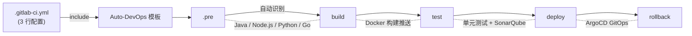
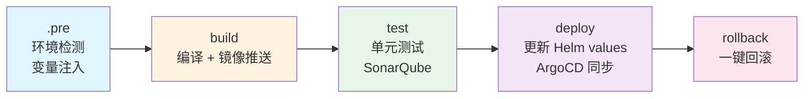
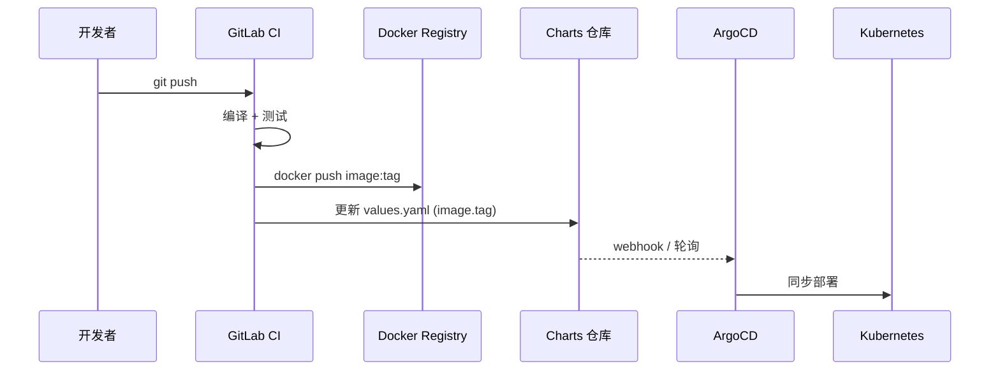

# gitlab-ci-templates

> 开箱即用的 GitLab CI/CD 模板。一行 `include`，完整流水线自动就位。

[](https://opensource.org/licenses/MIT)
[](https://github.com/cdryzun/gitlab-ci-templates/actions/workflows/ci.yml)
[](https://github.com/cdryzun/gitlab-ci-templates/actions/workflows/build-images.yml)
[](https://github.com/cdryzun?tab=packages)

[English](README.md) | 中文

---

6 行 YAML，拿到一条生产级流水线。自动识别 Java、Node.js、Python、Golang 项目类型，内置 Docker 构建、SonarQube 扫描、ArgoCD GitOps 部署和一键回滚。



---

## 为什么要用这套模板

<table>
<tr><th>没有模板（200+ 行）</th><th>用了模板（6 行）</th></tr>
<tr>
<td>

```yaml
stages:
  - build
  - test
  - docker
  - deploy

variables:
  MAVEN_OPTS: "-Dmaven.repo.local=.m2"

build:
  stage: build
  image: maven:3.9-eclipse-temurin-17
  script:
    - mvn clean package -DskipTests
  artifacts:
    paths: [target/]

test:
  stage: test
  image: maven:3.9-eclipse-temurin-17
  script:
    - mvn test

docker:
  stage: docker
  image: docker:24
  services: [docker:24-dind]
  script:
    - docker build -t $IMAGE .
    - docker push $IMAGE

# ... 还有 150 行部署、回滚、
# 扫描、缓存配置 ...
```

</td>
<td>

```yaml
include:
  - remote: 'https://raw.githubusercontent.com/cdryzun/gitlab-ci-templates/open/templates/Auto-DevOps.gitlab-ci.yml'

variables:
  BUILD_SHELL: "mvn clean package -DskipTests"
  DOCKERFILE_BUILD_JDK_VERSION: "17"
```

</td>
</tr>
</table>

每个项目都写一遍流水线配置，写到第三个就烦了。这套模板做的事情很简单：**把重复的部分抽出来，你只管写业务变量。**

---

## 30 秒接入

在项目根目录创建 `.gitlab-ci.yml`：

```yaml
include:
  - remote: 'https://raw.githubusercontent.com/cdryzun/gitlab-ci-templates/open/templates/Auto-DevOps.gitlab-ci.yml'
```

推送代码，流水线自动触发。

**私有化部署的 GitLab？** 把本仓库镜像到你的实例，用 `include: project:` 引用，完全走内网，不依赖外部网络。详见 [私有化部署指南](docs/cd/00-overview.md)。

---

## 各语言配置示例

### Java（Maven）

```yaml
include:
  - remote: 'https://raw.githubusercontent.com/cdryzun/gitlab-ci-templates/open/templates/Auto-DevOps.gitlab-ci.yml'

variables:
  BUILD_SHELL: "mvn clean package -DskipTests"
  DOCKERFILE_BUILD_JDK_VERSION: "17"
  MAVEN_APP_NAME: "my-service"        # JAR 文件名，ps 里直接能看到是哪个服务
```

### Java（Gradle）

```yaml
include:
  - remote: 'https://raw.githubusercontent.com/cdryzun/gitlab-ci-templates/open/templates/Auto-DevOps.gitlab-ci.yml'

variables:
  BUILD_SHELL: "gradle clean build -x test"
  DOCKERFILE_BUILD_JDK_VERSION: "17"
```

### Node.js 前端

```yaml
include:
  - remote: 'https://raw.githubusercontent.com/cdryzun/gitlab-ci-templates/open/templates/Auto-DevOps.gitlab-ci.yml'

variables:
  BUILD_SHELL: "pnpm run build"
  PACKAGE_MANAGER: "pnpm"             # 也支持 yarn
```

模板会自动检测 `package.json`，构建产物放进 Nginx 镜像。

### Node.js 后端（Express / Koa）

后端服务不走 Nginx，需要用自定义 Dockerfile：

```yaml
include:
  - remote: 'https://raw.githubusercontent.com/cdryzun/gitlab-ci-templates/open/templates/Auto-DevOps.gitlab-ci.yml'

variables:
  CUSTOM_DOCKERFILE: "true"
  CUSTOM_DOCKERFILE_PATH: "${CI_PROJECT_DIR}/Dockerfile"
  DOCKER_DAEMON_WORKSPACE: "/tmp/docker-build"
  DOCKER_WORKSPACE_PREPARE_CMD: "cp -r ${CI_PROJECT_DIR}/package.json ${CI_PROJECT_DIR}/src ."
  BUILD_SHELL: "mkdir -p dist"
  NODE_UNIT_TEST_SHELL: "npm test"
```

### Python

```yaml
include:
  - remote: 'https://raw.githubusercontent.com/cdryzun/gitlab-ci-templates/open/templates/Auto-DevOps.gitlab-ci.yml'
```

零配置。自动检测 `requirements.txt`，装依赖、打镜像一步到位。

### Golang

```yaml
include:
  - remote: 'https://raw.githubusercontent.com/cdryzun/gitlab-ci-templates/open/templates/Auto-DevOps.gitlab-ci.yml'
```

自动检测 `go.mod`，编译时自带 `-ldflags "-s -w"` 压缩二进制体积，输出的文件名跟项目名一致。

### Golang + Node.js（前端内嵌）

用 `go:embed` 打包前端资源的项目：

```yaml
include:
  - remote: 'https://raw.githubusercontent.com/cdryzun/gitlab-ci-templates/open/templates/Auto-DevOps.gitlab-ci.yml'

variables:
  BASE_BUILD_IMAGE: "ghcr.io/cdryzun/glci-builder-golang-nodejs:go1.24-node22"
  BUILD_SHELL: |
    cd web && pnpm install && pnpm build && cd ..
    && go mod tidy && go build -o app ./...
```

### React / Vue / Next.js

所有前端框架只要有 `package.json` 就能自动识别，设置构建命令即可：

```yaml
include:
  - remote: 'https://raw.githubusercontent.com/cdryzun/gitlab-ci-templates/open/templates/Auto-DevOps.gitlab-ci.yml'

variables:
  BUILD_SHELL: "pnpm run build"
  PACKAGE_MANAGER: "pnpm"
```

产物输出到 `dist/`，自动打包进 Nginx 镜像。Vite、Webpack 等打包工具均支持。

### 纯库项目（不构建镜像）

```yaml
variables:
  DOCKER_IMAGE_BUILD: "false"
```

更多示例见 [examples/](examples/) 目录。

---

## 流水线阶段



每个阶段干什么：

| 阶段 | 做了什么 |
|------|---------|
| `.pre` | 自动识别项目类型、分支语义，注入 Docker 镜像名、Tag、构建环境等变量 |
| `build` | 执行编译命令，构建 Docker 镜像并推送到 Registry |
| `test` | 运行单元测试，可选 SonarQube 代码质量扫描 |
| `deploy` | clone Helm charts 仓库，更新 `values.yaml` 中的镜像 Tag，ArgoCD 自动同步 |
| `rollback` | 手动触发，把镜像 Tag 回退到上一个版本 |

---

## GitOps 部署（ArgoCD）

CI 推送镜像 Tag 到 Helm values 仓库，ArgoCD 检测变更后自动同步集群：



**分支与环境的映射关系：**

| 代码分支 | 部署目标 | 行为 |
|---------|---------|------|
| `feat/*` / `feature/*` | dev 环境 | 可选自动部署 |
| `dev` | dev 环境 | 自动部署 |
| `sit` | sit 环境 | 自动部署 |
| `prd` / `v*.*.*` | prd 环境 | 创建 MR，需审批后合并 |

---

## 国内加速配置

在国内网络环境下，镜像拉取和依赖下载会比较慢。在 GitLab CI/CD 的 Settings > Variables 中配置以下变量即可加速：

### 镜像加速

| 变量 | 作用 | 推荐值 |
|------|------|--------|
| `IMAGE_MIRROR_PREFIX` | 加速构建镜像拉取（ghcr.io） | `你的代理地址/` |
| `DOCKER_MIRROR_PREFIX` | 加速 Dockerfile 基础镜像拉取 | `你的代理地址/` |

配置后，`ghcr.io/cdryzun/glci-builder-java:jdk17` 会变为 `你的代理地址/ghcr.io/cdryzun/glci-builder-java:jdk17`，走代理拉取。

### 依赖源加速

| 变量 | 作用 | 推荐值 |
|------|------|--------|
| `MAVEN_REGISTRY` | Maven 仓库镜像 | `https://maven.aliyun.com/repository/public` |
| `NODE_REGISTRY` | npm 包镜像 | `https://registry.npmmirror.com` |
| `PYPI` | pip 包镜像 | `https://pypi.tuna.tsinghua.edu.cn/simple` |
| `GO_GOPROXY` | Go 模块代理 | `https://goproxy.cn,direct` |

建议在 GitLab Group 级别统一配置，所有子项目自动继承。

---

## 构建镜像

所有构建镜像托管在 GitHub Container Registry，工具链预装完毕，CI 运行时无需额外下载。

| 镜像 | 版本 | 内置工具 |
|------|------|---------|
| `ghcr.io/cdryzun/glci-builder-java` | `jdk8` `jdk11` `jdk17` | Maven, Gradle, SonarScanner |
| `ghcr.io/cdryzun/glci-builder-nodejs` | `18` `20` `24` | pnpm, yarn, npm |
| `ghcr.io/cdryzun/glci-builder-python` | `3.10` `3.11` `3.12` | pip, poetry |
| `ghcr.io/cdryzun/glci-builder-golang` | `1.21` `1.22` `1.23` | Go 工具链 |
| `ghcr.io/cdryzun/glci-builder-golang-nodejs` | `go1.23-node20` 等 | Go + Node.js |
| `ghcr.io/cdryzun/glci-toolbox` | `latest` | docker, helm, glab, yq, argocd |

---

## 变量速查

完整列表（60+ 变量）见 **[变量参考文档](docs/VARIABLE_REFERENCE.md)**。

最常用的几个：

| 变量 | 默认值 | 说明 |
|------|--------|------|
| `BUILD_SHELL` | 自动检测 | 构建命令，不填则按项目类型自动选择 |
| `PROJECT_TYPE` | 自动检测 | `java` / `web` / `python` / `golang` |
| `DOCKER_IMAGE_BUILD` | `true` | 库项目设为 `false`，跳过镜像构建 |
| `UNIT_TEST_ENABLE` | `true` | 是否执行单元测试 |
| `CUSTOM_DOCKERFILE` | 自动检测 | 项目根目录有 Dockerfile 时自动启用 |
| `DEPLOY_REPO` | -- | Helm charts 仓库地址，配置后启用 CD |
| `MAVEN_APP_NAME` | `app` | JAR 包名称，影响容器内进程名 |

---

## 项目结构

```
templates/              # 入口文件 -- 下游项目 include 这里
jobs-templates/         # 按阶段拆分的 Job 定义
utils/                  # 规则片段、before/after 脚本
vars/                   # 默认变量配置
scripts/                # CI Job 执行的 Shell 脚本
dockerfile/templates/   # 应用 Dockerfile 模板
images/                 # 构建镜像的 Dockerfile 源码
examples/               # 各语言的配置示例
```

双轨制版本管理：`*.stable.*` 是生产版本，`*.latest.*` 是实验版本。

---

## 安全

- 每次推送自动运行 [Gitleaks](https://github.com/gitleaks/gitleaks) 密钥泄露扫描
- 支持 [Trivy](https://github.com/aquasecurity/trivy) 容器漏洞扫描
- 安全问题报告流程见 [SECURITY.md](SECURITY.md)

---

## 文档

- **[变量参考](docs/VARIABLE_REFERENCE.md)** -- 全量变量清单
- **[CD 部署指南](docs/cd/00-overview.md)** -- 从零搭建 K3s + ArgoCD + GitOps
- **[故障排查](docs/troubleshooting/README.md)** -- 常见问题与解决方案
- **[模板开发 SOP](docs/SOP-Template-Development.md)** -- 模板开发规范
- **[更新日志](CHANGELOG.md)** -- 版本变更记录

---

## 参与贡献

欢迎提 Issue 和 PR。贡献指南见 [CONTRIBUTING.md](CONTRIBUTING.md)。

如果这个项目帮到了你，点个 Star 让更多人看到。

---

## 许可证

MIT -- 详见 [LICENSE](LICENSE)。
