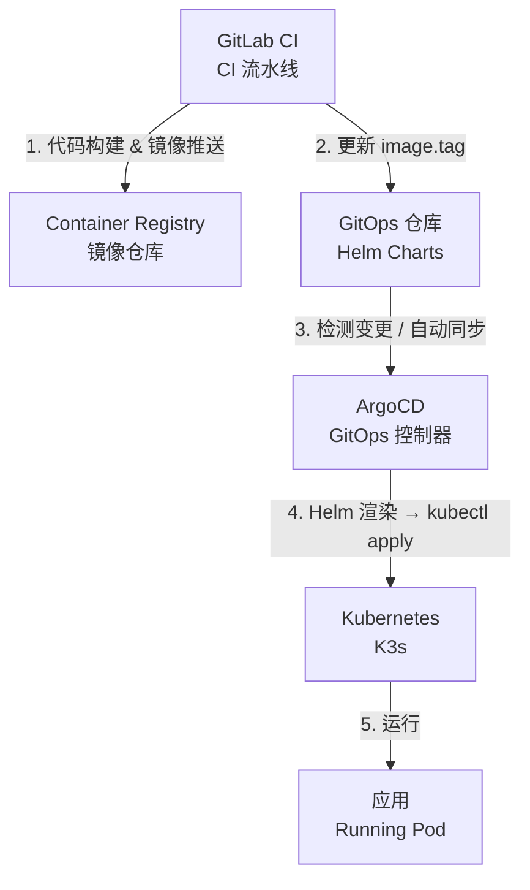

# CD 环境从零搭建指南

## 概述

本系列文档描述如何在单台服务器上从零搭建基于 K3s + ArgoCD 的 GitOps CD 环境，并与 GitLab CI 的 Auto-DevOps 模板集成，实现完整的应用持续交付流程。

## 目标架构

## 文档章节

| 章节 | 文件 | 内容 |
|------|------|------|
| 01 | [K3s 安装](./01-k3s-installation.md) | 安装 K3s 单节点集群 |
| 02 | [ArgoCD 安装](./02-argocd-installation.md) | Helm 安装 ArgoCD |
| 03 | [GitOps 仓库](./03-gitops-repo-setup.md) | 创建 Helm Charts 仓库结构（单应用独立仓库） |
| 04 | [ArgoCD 接入](./04-argocd-gitops-integration.md) | ArgoCD 接入 GitOps 仓库 |
| 05 | [CI/CD 集成](./05-cicd-integration.md) | GitLab CI 触发 CD 流程 |
| 06 | [多项目 GitOps](./06-multi-project-gitops.md) | 单仓库多项目管理与 CD 集成 |

## GitOps 仓库架构选型

根据团队规模和项目组织方式，可选择以下两种仓库模式：

| 模式 | 参考章节 | 适用场景 |
|------|---------|---------|
| **单应用独立仓库** 每个应用拥有独立的 GitOps 仓库 | 章 03~05 | 项目间独立部署、需要独立权限控制、跨团队协作 |
| **单仓库多项目** 所有应用共享一个 GitOps 仓库，以文件夹区分 | 章 06 | 同一团队管理多个服务、希望统一治理 |

两种模式的核心 CD 逻辑完全相同，主要差异在于 GitOps 仓库结构和 ArgoCD Application 命名规则。

## 系统要求

| 项目 | 要求 |
|------|------|
| 操作系统 | Debian 12 / Ubuntu 22.04+ |
| CPU | 4 核以上 |
| 内存 | 8 GB 以上 |
| 磁盘 | 50 GB 以上 |
| 网络 | 可访问互联网（拉取镜像）|

## 端口说明

| 端口 | 用途 |
|------|------|
| 6443 | K3s API Server |
| 30080 | ArgoCD Web UI (HTTP, NodePort) |
| 30443 | ArgoCD Web UI (HTTPS, NodePort) |

## 注意事项

**在 Proxmox VE 宿主机上部署 K3s 的限制**

若 K3s 部署在 PVE 宿主机，而 GitLab/其他服务运行在 PVE 虚拟机上，Pod 网络无法直接访问 PVE 虚拟机 IP（受 PVE 网桥隔离）。解决方案见 [04-argocd-gitops-integration.md](./04-argocd-gitops-integration.md)。
