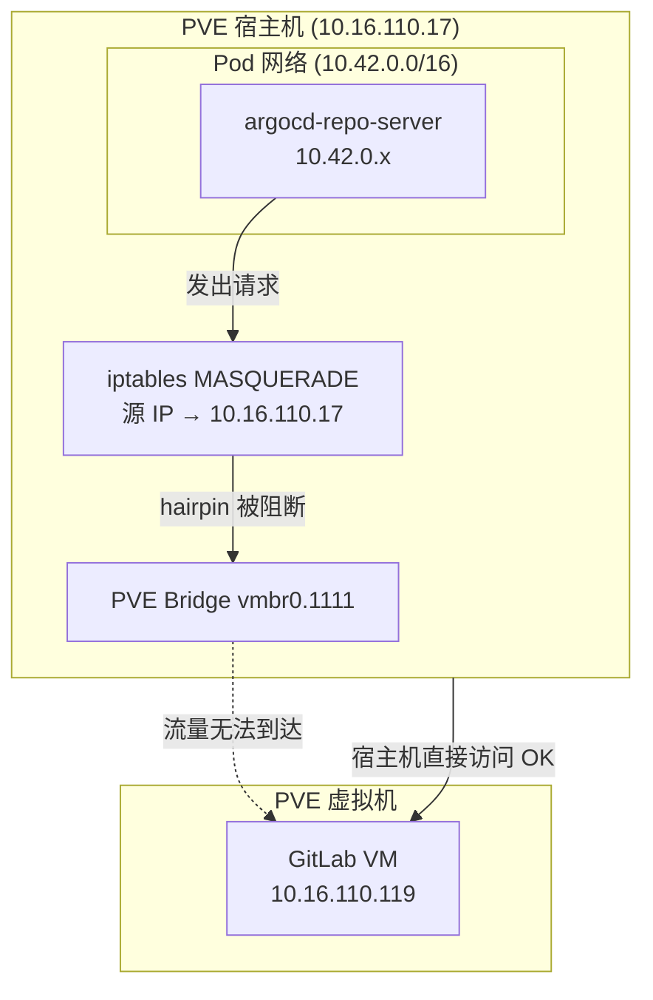

# 第四章：ArgoCD 接入 GitOps 仓库

## 说明

本章将 GitLab 上的 GitOps 仓库注册到 ArgoCD，并创建 ArgoCD Application，实现自动化部署。

## 1. 注册 GitLab 仓库

### 1.1 准备 GitLab Access Token

在 GitLab 创建 Personal Access Token（至少需要 `read_repository` 权限）：

GitLab → User Settings → Access Tokens → 创建 Token（勾选 `read_repository`）

### 1.2 注册仓库到 ArgoCD

```bash
NODE_IP="10.16.110.17"
GITLAB_URL="https://gitlab.example.com"
GITLAB_TOKEN="<YOUR_GITLAB_TOKEN>"

argocd repo add "${GITLAB_URL}/gitops/go-hello.git" \
  --username oauth2 \
  --password "${GITLAB_TOKEN}" \
  --plaintext \
  --server "${NODE_IP}:30080"
```

验证：

```bash
argocd repo list --server "${NODE_IP}:30080"
```

预期输出：

```
TYPE  NAME  REPO                                          INSECURE  STATUS      MESSAGE
git         https://gitlab.example.com/gitops/go-hello.git  false   Successful
```

## 2. 创建 ArgoCD Application

### 2.1 创建 DEV 环境 Application

```bash
NODE_IP="10.16.110.17"

# 创建 namespace
kubectl create namespace go-hello-dev

# 创建 ArgoCD Application
argocd app create go-hello-dev \
  --repo https://gitlab.example.com/gitops/go-hello.git \
  --path go-hello \
  --revision dev \
  --dest-server https://kubernetes.default.svc \
  --dest-namespace go-hello-dev \
  --values values-dev.yaml \
  --sync-policy automated \
  --auto-prune \
  --self-heal \
  --server "${NODE_IP}:30080"
```

参数说明：

| 参数 | 说明 |
|------|------|
| `--revision dev` | 跟踪 `dev` 分支 |
| `--path go-hello` | Chart 在仓库中的路径 |
| `--values values-dev.yaml` | 叠加 DEV 环境差异配置 |
| `--sync-policy automated` | 检测到 Git 变更后自动同步 |
| `--auto-prune` | 自动删除 Git 中已移除的资源 |
| `--self-heal` | 集群资源被手动修改时自动恢复 |

### 2.2 查看 Application 状态

```bash
argocd app get go-hello-dev --server "${NODE_IP}:30080"
```

预期输出（同步并健康）：

```
Name:               argocd/go-hello-dev
Sync Status:        Synced to dev (abc1234)
Health Status:      Healthy

GROUP  KIND        NAMESPACE     NAME          STATUS  HEALTH
       Service     go-hello-dev  go-hello-dev  Synced  Healthy
apps   Deployment  go-hello-dev  go-hello-dev  Synced  Healthy
```

### 2.3 验证 K8s 资源创建

```bash
kubectl get pods,svc -n go-hello-dev
```

## 3. 手动触发同步

```bash
# 立即同步（不等待自动检测）
argocd app sync go-hello-dev --server "${NODE_IP}:30080"
```

## 4. 在 Proxmox VE 宿主机环境的特殊说明

**问题**：K3s Pod 网络（10.42.0.0/16）无法直接访问 PVE 虚拟机 IP（如 GitLab VM 10.16.110.119），因为 PVE bridge（vmbr0）隔离了宿主机到 VM 的直接流量。

**现象**：
```
argocd repo add ...
# 错误: rpc error: ... context deadline exceeded
```

**根本原因（网络拓扑）**：



- PVE 宿主机上的 Pod（10.42.0.x）发出的数据包经过 MASQUERADE 后，源 IP 变为宿主机 IP
- 但 PVE 的 bridge 转发机制阻止了宿主机发出的流量进入 VM 网络（hairpin 问题）
- 外网访问（如 8.8.8.8）同样无法访问

**解决方案：为 repo-server 启用 hostNetwork**

```bash
kubectl patch deployment argocd-repo-server -n argocd --type=json -p='[
  {"op": "add", "path": "/spec/template/spec/hostNetwork", "value": true},
  {"op": "add", "path": "/spec/template/spec/dnsPolicy", "value": "ClusterFirstWithHostNet"}
]'
```

等待 repo-server 重启：

```bash
kubectl rollout status deployment/argocd-repo-server -n argocd
```

验证 repo-server 使用宿主机 IP：

```bash
kubectl get pods -n argocd -l app.kubernetes.io/name=argocd-repo-server -o wide
# IP 列应显示宿主机 IP（如 10.16.110.17）
```

此后 repo-server 具有与宿主机相同的网络访问权限，可正常访问 GitLab VM。

**注意**：application-controller 无需 hostNetwork，因为它通过 K8s API Server 操作资源，不需要直接访问外部服务。

## 5. 配置 GitLab Webhook（可选，实现即时同步）

默认 ArgoCD 每 3 分钟轮询一次 Git 仓库。配置 Webhook 可在 Git push 后立即触发同步。

在 GitLab 项目设置中添加 Webhook：

- URL：`http://<NODE_IP>:30080/api/webhook`
- Trigger：Push events
- Secret Token：（可选，在 ArgoCD 中配置）

## 下一步

[第五章：GitLab CI/CD 集成](./05-cicd-integration.md)
