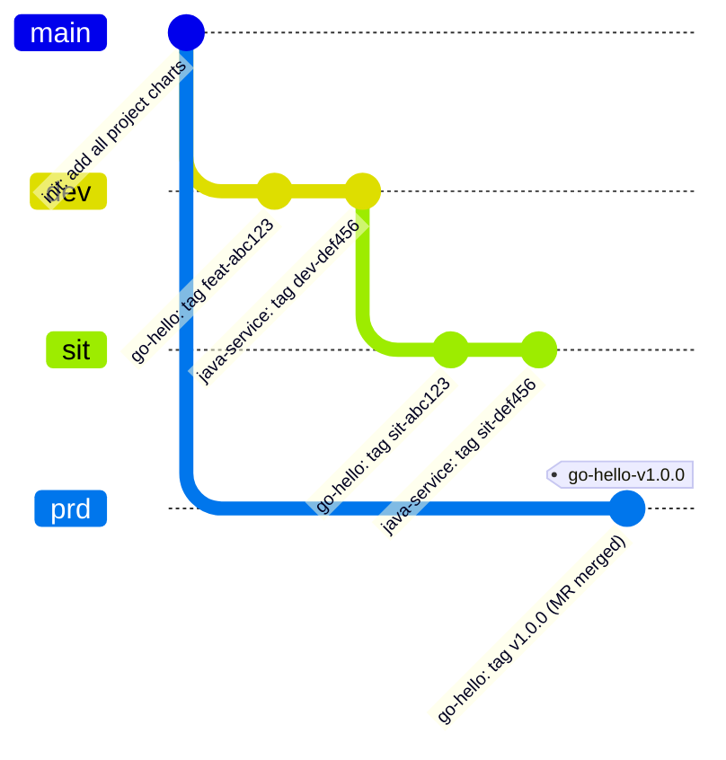
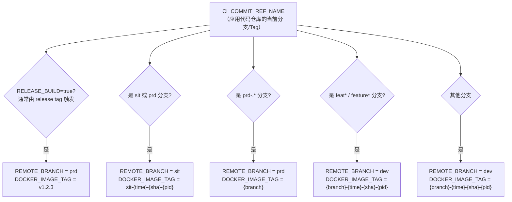
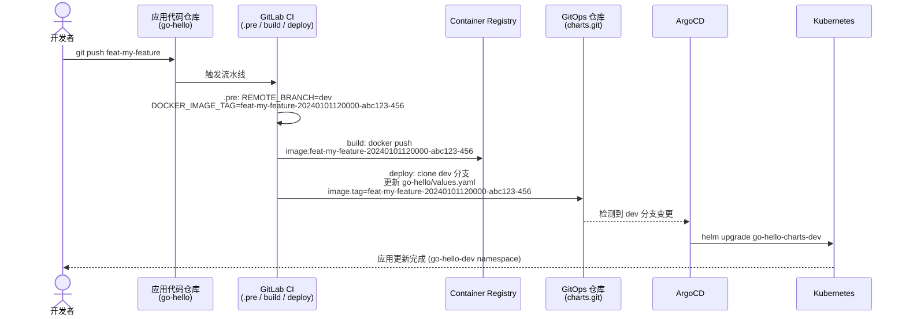
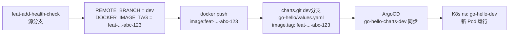
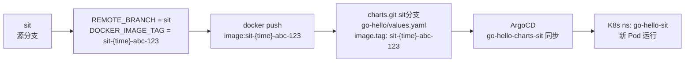
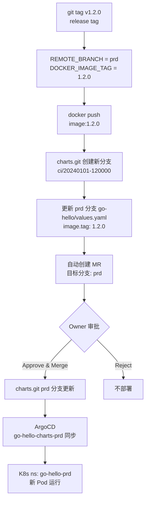
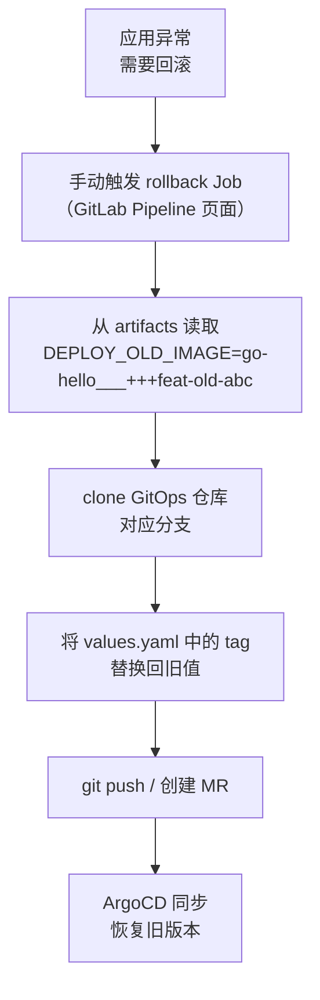

# 第六章：多项目 GitOps 仓库设计与 CD 集成

## 说明

本章解决两个核心问题：

1. **如何在一个 GitOps 仓库中管理多个项目**，并以分支区分不同环境
2. **CD Stage 如何与 GitOps 仓库配合**，实现从 CI 镜像构建到 ArgoCD 自动部署的完整链路

> **与第三章的关系**：[第三章](./03-gitops-repo-setup.md)展示每个应用拥有独立 GitOps 仓库的模式（适合项目间完全独立、需要单独权限控制的场景）。本章展示**单仓库多项目**模式（适合同一团队管理多个服务、希望统一治理的场景）。两种模式可按需选择，核心 CD 逻辑相同，主要差异体现在仓库结构和 ArgoCD Application 命名上。

## 1. 多项目 GitOps 仓库设计

### 1.1 仓库结构：文件夹隔离项目，分支隔离环境

```
gitops/charts.git
│
├── go-hello/          ← Golang 项目
│   ├── Chart.yaml
│   ├── values.yaml    ← CI 更新此文件中的 image.tag
│   └── templates/
│       ├── deployment.yaml
│       └── service.yaml
│
├── java-service/      ← Java 项目
│   ├── Chart.yaml
│   ├── values.yaml
│   └── templates/
│
├── python-api/        ← Python 项目
│   ├── Chart.yaml
│   ├── values.yaml
│   └── templates/
│
└── nodejs-web/        ← Node.js 项目
    ├── Chart.yaml
    ├── values.yaml
    └── templates/
```

每个环境对应一个独立分支，同一套文件结构，但 `values.yaml` 中的 `image.tag` 不同：



### 1.2 分支与环境对应关系

| GitOps 分支 | K8s 环境 | Namespace 规范 | 更新方式 |
|------------|---------|---------------|---------|
| `dev` | DEV | `{project}-dev` | CI 直接推送 |
| `sit` | SIT | `{project}-sit` | CI 直接推送 |
| `prd` | PRD | `{project}-prd` | CI 创建 MR，人工审批合并 |

> `prd` 分支应在 GitLab 设置为受保护分支（Protected Branch），仅允许通过 MR 合并。

### 1.3 REMOTE_BRANCH 自动推导规则

CI 模板在 `.pre` 阶段根据**应用代码仓库的源分支**自动推导 `REMOTE_BRANCH`（GitOps 目标分支）：



> **注意**：进入 `prd` 的 release tag 路径（R1）依赖变量 `RELEASE_BUILD=true`。推送 release tag 时，需要在 `.gitlab-ci.yml` 中配置 `RELEASE_BUILD: "true"`，否则会回退到 `dev`。
>
> 可通过 `CUSTOM_REMOTE_SIT_BRANCH` 和 `CUSTOM_REMOTE_PRD_BRANCH` 自定义映射关系。

## 2. ArgoCD Application 命名约定

**这是整套方案能否正常运作的关键。** CD 脚本在触发 ArgoCD 同步时，会按以下规则构造 Application 名称：

```
ArgoCD App 名 = {DEPLOY_REPO_PROJ}-{GitOps仓库名}-{REMOTE_BRANCH}
```

其中：
- `DEPLOY_REPO_PROJ`：GitOps 仓库中的**项目文件夹名**（如 `go-hello`）
- `GitOps仓库名`：从 `DEPLOY_REPO` URL 中提取的仓库名（`charts.git` → `charts`）
- `REMOTE_BRANCH`：目标环境分支（`dev` / `sit` / `prd`）

**示例**：

| DEPLOY_REPO | DEPLOY_REPO_PROJ | REMOTE_BRANCH | ArgoCD App 名 |
|------------|-----------------|---------------|--------------|
| `.../gitops/charts.git` | `go-hello` | `dev` | `go-hello-charts-dev` |
| `.../gitops/charts.git` | `go-hello` | `sit` | `go-hello-charts-sit` |
| `.../gitops/charts.git` | `go-hello` | `prd` | `go-hello-charts-prd` |
| `.../gitops/charts.git` | `java-service` | `dev` | `java-service-charts-dev` |

**因此，创建 ArgoCD Application 时必须严格按此规则命名。**

### 2.1 批量创建所有环境的 Application

以 `go-hello` 为例，在 K3s 上创建三个环境的 Application：

```bash
CHARTS_REPO="https://gitlab.example.com/gitops/charts.git"
GITLAB_TOKEN="<YOUR_TOKEN>"
NODE_IP="10.16.110.17"

for ENV in dev sit prd; do
  kubectl create namespace "go-hello-${ENV}" --dry-run=client -o yaml | kubectl apply -f -

  argocd app create "go-hello-charts-${ENV}" \
    --repo "${CHARTS_REPO}" \
    --path go-hello \
    --revision "${ENV}" \
    --dest-server https://kubernetes.default.svc \
    --dest-namespace "go-hello-${ENV}" \
    --sync-policy automated \
    --auto-prune \
    --self-heal \
    --server "${NODE_IP}:30080"
done
```

## 3. 与 CD Stage 的完整配合

### 3.1 数据流全景



> **DOCKER_IMAGE_TAG 格式**：`{branch}-{BUILD_TIME}-{CI_COMMIT_SHORT_SHA}-{CI_PIPELINE_ID}`
> 其中 `BUILD_TIME` 精确到分钟（如 `20240101120000`），确保同一分支多次构建的标签唯一，避免镜像覆盖。

### 3.2 CI 变量配置一览

在应用项目（go-hello）的 GitLab CI/CD Variables 中配置：

| 变量 | 配置位置 | 示例值 | 说明 |
|------|---------|--------|------|
| `DEPLOY_REPO` | Project Variables | `https://gitlab.example.com/gitops/charts.git` | GitOps 仓库地址 |
| `DEPLOY_REPO_PROJ` | .gitlab-ci.yml 或 Variables | `go-hello` | GitOps 仓库中的项目文件夹名 |
| `DEPLOY_VALUE_FILE` | .gitlab-ci.yml | `values.yaml` | 要更新的 values 文件 |
| `DEPLOY_REPO_YAML_TAG` | .gitlab-ci.yml | `.image.tag` | yq 路径，指向 image tag 字段 |
| `GITLAB_REPO_COMMIT_TOKEN` | Project Variables (Masked) | `glpat-xxxx` | 有 GitOps 仓库 write 权限的 Token |
| `ARGOCD_SERVER` | Group/Project Variables | `10.16.110.17:30080` | ArgoCD 地址（无需 https://） |
| `ARGOCD_AUTH_TOKEN` | Project Variables (Masked) | `xxxx` | ArgoCD API Token |
| `DEV_CD_AUTO_DEPLOY` | .gitlab-ci.yml | `"true"` | DEV 环境自动触发 CD |
| `SIT_CD_AUTO_DEPLOY` | .gitlab-ci.yml | `"true"` | SIT 环境自动触发 CD |
| `PRD_CD_AUTO_DEPLOY` | .gitlab-ci.yml | `"true"` | PRD 环境（创建 MR） |

> `GITLAB_REPO_COMMIT_TOKEN` 和 `ARGOCD_AUTH_TOKEN` 建议配置在 Group Variables，所有项目共享。

## 4. Golang 项目完整流程（端到端示例）

### 4.1 前置准备

**Step 1：确认 GitOps 仓库有对应分支和目录**

```bash
cd /tmp/gitops-charts

# 确保三个环境分支都存在
git checkout dev    && ls go-hello/
git checkout sit    && ls go-hello/
git checkout prd    && ls go-hello/
```

**Step 2：创建 ArgoCD Application（仅首次）**

```bash
# 见 2.1 节的批量创建命令
argocd app list --server 10.16.110.17:30080 | grep go-hello
# go-hello-charts-dev   ...  Synced  Healthy
# go-hello-charts-sit   ...  Synced  Healthy
# go-hello-charts-prd   ...  Synced  Healthy
```

**Step 3：配置应用仓库 .gitlab-ci.yml**

```yaml
include:
  - remote: 'https://raw.githubusercontent.com/cdryzun/gitlab-ci-templates/open/templates/Auto-DevOps.gitlab-ci.yml'

variables:
  # 构建
  BUILD_SHELL: "go mod tidy && go build -o ${CI_PROJECT_NAME} ./..."
  FEAT_DOCKER_IMAGE_BUILD: "true"
  UNIT_TEST_ENABLE: "true"

  # CD 配置（指向 charts 仓库中的 go-hello 文件夹）
  DEPLOY_REPO: "https://gitlab.example.com/gitops/charts.git"
  DEPLOY_REPO_PROJ: "go-hello"
  DEPLOY_VALUE_FILE: "values.yaml"
  DEPLOY_REPO_YAML_TAG: ".image.tag"

  # 各环境 CD 开关
  DEV_CD_AUTO_DEPLOY: "true"
  SIT_CD_AUTO_DEPLOY: "true"
  PRD_CD_AUTO_DEPLOY: "true"
```

### 4.2 各场景流程详解

#### 场景 A：功能开发 → DEV 部署

```
git push origin feat-add-health-check
```



#### 场景 B：集成测试 → SIT 部署

```
git push origin sit
```



#### 场景 C：版本发布 → PRD 部署（MR 审批）

```
git tag v1.2.0 && git push origin v1.2.0
```



### 4.3 ARGOCD_AUTH_TOKEN 获取方式

```bash
# 在 ArgoCD 中创建 Service Account Token
argocd account generate-token \
  --account pipeline \
  --server 10.16.110.17:30080

# 或创建专用账号
argocd account update-password \
  --account pipeline \
  --new-password "<STRONG_PASSWORD>" \
  --server 10.16.110.17:30080

argocd account generate-token --account pipeline --server 10.16.110.17:30080
```

将生成的 token 存入 GitLab CI/CD Variables（建议 Group 级别，所有项目共享）。

## 5. 多项目 values.yaml 结构规范

所有项目的 `values.yaml` 建议统一 `image` 字段结构，确保 CI 的 `DEPLOY_REPO_YAML_TAG: ".image.tag"` 通用：

```yaml
# go-hello/values.yaml (dev 分支)
replicaCount: 1

image:
  repository: registry.gitlab.example.com/sre/devops/go-hello
  pullPolicy: IfNotPresent
  tag: "feat-my-feature-20240101-abc123-456"  # ← CI 自动更新此字段

service:
  type: ClusterIP
  port: 2025
```

若某项目使用不同的字段路径，通过 `DEPLOY_REPO_YAML_TAG` 单独覆盖：

```yaml
# java-service: image 在 .deployment.image.tag
DEPLOY_REPO_YAML_TAG: ".deployment.image.tag"
```

## 6. 回滚流程

CI 流水线在 deploy 阶段会将旧 tag 保存到 artifacts (`cd.env`)，回滚时读取此值：



## 下一步

- 配置 GitLab Webhook 实现 ArgoCD 即时同步（见 [第四章](./04-argocd-gitops-integration.md#5-配置-gitlab-webhook可选实现即时同步)）
- 为 `prd` 分支配置 GitLab Branch Protection Rules 和 CODEOWNERS
