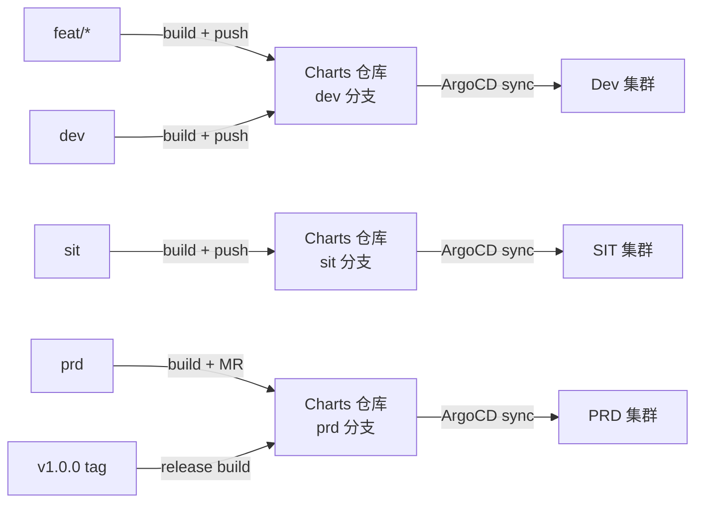
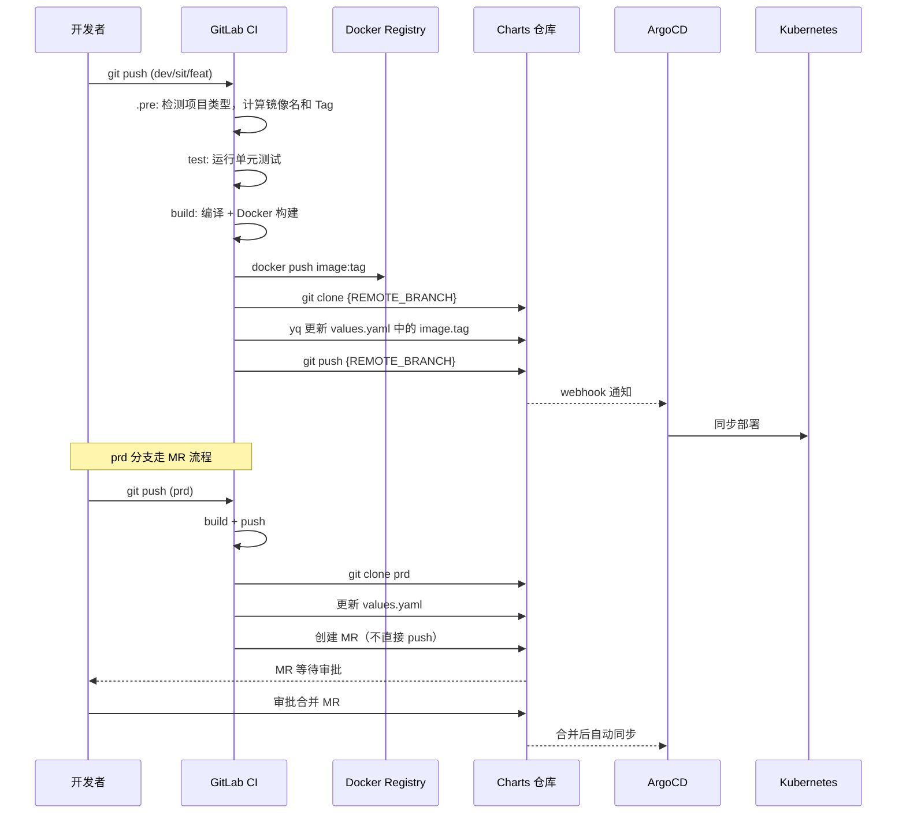

# 分支工作流与发布策略

## 设计原则

一句话总结：**代码分支决定部署环境，Git 是唯一的事实来源。**

模板采用环境分支模型（Environment Branching），不是 Git Flow，也不是 Trunk-Based。选择这个模型的原因：

- GitLab 的 protected branch + MR approval 天然覆盖生产审批，不需要额外的发布系统
- ArgoCD 的 `targetRevision` 按分支追踪，每个环境一个分支，配置最简
- 回滚就是 `git revert` 一个 commit，不需要复杂的回滚机制

## 分支到环境映射



| 代码分支 | Charts 分支 | Docker Tag 格式 | 部署行为 |
|---------|-----------|----------------|---------|
| `feat/*` / `feature/*` | `dev` | `feat-xxx-{time}-{sha}-{pipeline}` | 需设置 `FEAT_CD_AUTO_DEPLOY=true` |
| `dev` | `dev` | `dev-{time}-{sha}-{pipeline}` | 自动部署 |
| `sit` | `sit` | `sit-{time}-{sha}-{pipeline}` | 自动部署 |
| `prd` | `prd` | `prd-{time}-{sha}-{pipeline}` | 创建 MR，审批后合并 |
| `v*.*.*` (tag) | `prd` | `1.0.0` (去掉 v 前缀) | Release 构建，直接推送 |
| `prd-{tag}` | `prd` | `prd-{tag}` | 用于 Tag 回滚场景 |

## 完整流水线流程



## Git Tag 与 Release

### 自动 Tag 创建

当 `PRD_BUILD_CREATE_TAG=true`（默认开启），prd 分支的每次构建会自动：

1. 创建 GitLab Release + Tag（名称为 Docker Image Tag）
2. 生成 changelog，记录触发人、时间、分支
3. 如果配置了 `DEPLOY_REPO`，Release 会关联 Charts 仓库链接
4. 自动清理旧 Tag，保留最近 N 个（由 `PRD_CD_CREATE_TAG_NUM` 控制，默认 20）

### Release 构建（语义化版本）

推送 `v1.0.0` 格式的 Git Tag 时：

```bash
git tag v1.0.0
git push origin v1.0.0
```

模板自动识别为 Release 构建：
- `RELEASE_BUILD=true`
- Docker Tag 去掉 `v` 前缀，直接用版本号：`my-service:1.0.0`
- 部署目标：`prd` 分支

### 镜像 ReTag（避免重复构建）

如果 `RELEASE_RETAG_DISABLE` 不为 `true`，Release 构建会优先查找已有镜像进行 ReTag，而不是重新构建。省时间，保证和测试环境一致。

## PRD 分支的 MR 审批机制

当 `REMOTE_BRANCH == 'prd'` 时，CI 不直接 push 到 Charts 仓库的 prd 分支，而是：

1. 从 prd 分支 checkout 一个时间戳命名的临时分支
2. 自动查找仓库中所有 Owner 权限用户作为 Reviewer
3. 创建 MR，目标分支为 prd，设置 `--remove-source-branch`
4. 等待人工审批合并

这保证了生产环境的变更必须经过审批，不会被 CI 自动覆盖。

## 回滚策略

### 方式一：CD 回滚 Job（内置）

流水线内置 `cd-rollback` job（manual 触发），执行：

1. 读取上一次部署记录的旧 image tag（存在 `cd.env` 中）
2. 用旧 tag 覆盖 Charts 仓库中的 `values.yaml`
3. 推送变更，ArgoCD 自动同步回旧版本

### 方式二：Git Revert（推荐）

直接在 Charts 仓库的对应分支上 revert 最近一个 commit：

```bash
cd charts-repo
git revert HEAD
git push origin dev  # 或 sit / prd
```

ArgoCD 检测到变更后自动回滚。这种方式更清晰，有完整的 Git 历史。

### 方式三：ArgoCD 手动回滚

在 ArgoCD UI 中选择历史版本，点击 Rollback。适合紧急场景。

## 相关变量

| 变量 | 默认值 | 说明 |
|------|--------|------|
| `DEPLOY_REPO` | -- | Charts 仓库 Git 地址（必填才能启用 CD） |
| `DEPLOY_VALUE_FILE` | `values.yaml` | 要更新的 YAML 文件，支持逗号分隔多文件 |
| `DEPLOY_REPO_YAML_TAG` | `.image.tag` | yq 路径，指定更新哪个字段 |
| `DEPLOY_REPO_PROJ` | `${CI_PROJECT_NAME}` | Charts 仓库中的项目目录名 |
| `REMOTE_BRANCH` | 自动计算 | Charts 仓库目标分支（dev/sit/prd） |
| `CUSTOM_REMOTE_SIT_BRANCH` | -- | 覆盖 sit 的 Charts 目标分支 |
| `CUSTOM_REMOTE_PRD_BRANCH` | -- | 覆盖 prd 的 Charts 目标分支 |
| `FEAT_CD_AUTO_DEPLOY` | `false` | feat 分支是否自动部署 |
| `DEV_CD_AUTO_DEPLOY` | `true` | dev 分支是否自动部署 |
| `SIT_CD_AUTO_DEPLOY` | `true` | sit 分支是否自动部署 |
| `PRD_CD_AUTO_DEPLOY` | `true` | prd 分支是否自动部署（通过 MR） |
| `PRD_BUILD_CREATE_TAG` | `true` | prd 构建后是否自动创建 Release Tag |
| `PRD_CD_CREATE_TAG_NUM` | `20` | 保留的 Release Tag 数量上限 |
| `RELEASE_BUILD` | `false` | 是否为 Release 构建（v*.*.* tag 自动设置） |
| `RELEASE_RETAG_DISABLE` | `false` | 禁用 ReTag，强制重新构建 |
| `DEPLOY_COMMIT_MESSAGE` | `chore: helm values updated...` | CI 自动提交的 commit message |
| `GIT_AUTO_COMMIT_NAME` | `ci-bot` | CI 提交使用的 Git 用户名 |
| `GIT_AUTO_COMMIT_EMAIL` | `ci-bot@example.com` | CI 提交使用的 Git 邮箱 |
