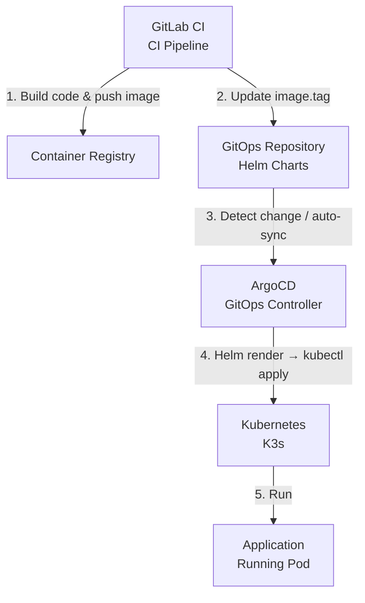

# CD Environment Setup Guide

## Overview

This guide describes how to set up a GitOps-based CD environment using K3s and ArgoCD from scratch on a single server, and integrate it with the gitlab-ci-templates Auto-DevOps pipeline for complete application continuous delivery.

## Target Architecture

## Chapters

| Chapter | File | Content |
|---------|------|---------|
| 01 | [K3s Installation](./01-k3s-installation.md) | Install K3s single-node cluster |
| 02 | [ArgoCD Installation](./02-argocd-installation.md) | Install ArgoCD via Helm |
| 03 | [GitOps Repository](./03-gitops-repo-setup.md) | Create Helm Charts repository structure (single-app dedicated repo) |
| 04 | [ArgoCD Integration](./04-argocd-gitops-integration.md) | Connect ArgoCD to GitOps repository |
| 05 | [CI/CD Integration](./05-cicd-integration.md) | GitLab CI triggers CD pipeline |
| 06 | [Multi-Project GitOps](./06-multi-project-gitops.md) | Single-repo multi-project management and CD integration |

## GitOps Repository Architecture Selection

Choose one of the following repository models based on your team size and project organization:

| Model | Reference | Use Case |
|-------|-----------|----------|
| **Single-app dedicated repository** Each application has its own GitOps repository | Chapters 03-05 | Independent deployments, separate access control, cross-team collaboration |
| **Single-repo multi-project** All applications share one GitOps repository, separated by folders | Chapter 06 | One team managing multiple services with unified governance |

The core CD logic is identical for both models. The main differences are in GitOps repository structure and ArgoCD Application naming conventions.

## System Requirements

| Item | Requirement |
|------|-------------|
| OS | Debian 12 / Ubuntu 22.04+ |
| CPU | 4 cores or more |
| Memory | 8 GB or more |
| Disk | 50 GB or more |
| Network | Internet access (for pulling images) |

## Port Reference

| Port | Purpose |
|------|---------|
| 6443 | K3s API Server |
| 30080 | ArgoCD Web UI (HTTP, NodePort) |
| 30443 | ArgoCD Web UI (HTTPS, NodePort) |

## Note: Running K3s on a Proxmox VE Host

If K3s is deployed on a PVE hypervisor host while GitLab or other services run as PVE VMs, pod networks cannot directly access PVE VM IPs (due to PVE bridge isolation). See [04-argocd-gitops-integration.md](./04-argocd-gitops-integration.md) for the workaround.
