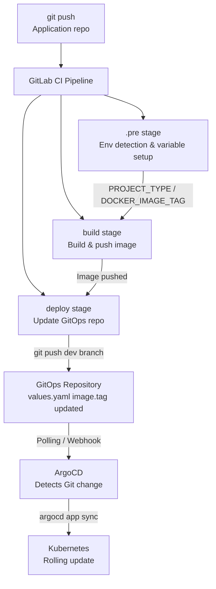
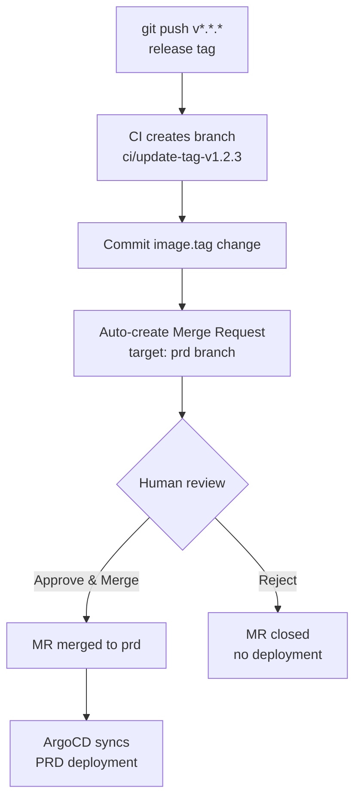

# Chapter 5: GitLab CI/CD Integration

## Overview

This chapter explains how to use the gitlab-ci-templates Auto-DevOps pipeline to automatically update the GitOps repository after a CI build, triggering an ArgoCD deployment.

## Complete CD flow



## 1. CI variable configuration

Set the following variables in GitLab: project Settings → CI/CD → Variables

| Variable | Example | Description |
|----------|---------|-------------|
| `DEPLOY_REPO` | `https://gitlab.example.com/gitops/go-hello.git` | GitOps repository URL |
| `GITLAB_REPO_COMMIT_TOKEN` | `glpat-xxxx` | Token with write access to the GitOps repo |
| `DEPLOY_REPO_YAML_TAG` | `.image.tag` | yq path to the image tag field in values.yaml |
| `DEPLOY_VALUE_FILE` | `values-dev.yaml` | Values file to update |
| `DEPLOY_REPO_PROJ` | `go-hello` | Chart directory name inside the GitOps repo |
| `ARGOCD_SERVER` | `10.16.110.17:30080` | ArgoCD address (optional, for forced sync) |
| `ARGOCD_AUTH_TOKEN` | `xxxx` | ArgoCD API token (optional) |

## 2. Configure .gitlab-ci.yml in the application repo

```yaml
include:
  - remote: 'https://raw.githubusercontent.com/cdryzun/gitlab-ci-templates/open/templates/Auto-DevOps.gitlab-ci.yml'

variables:
  # Build
  BUILD_SHELL: "go mod tidy && go build -o ${CI_PROJECT_NAME} ./..."

  # Enable Docker image build
  FEAT_DOCKER_IMAGE_BUILD: "true"

  # Enable unit tests
  UNIT_TEST_ENABLE: "true"

  # CD configuration
  DEPLOY_REPO: "https://gitlab.example.com/gitops/go-hello.git"
  DEPLOY_REPO_YAML_TAG: ".image.tag"
  DEPLOY_VALUE_FILE: "values-dev.yaml"
  DEPLOY_REPO_PROJ: "go-hello"

  # Auto-deploy switches per environment
  DEV_CD_AUTO_DEPLOY: "true"
  SIT_CD_AUTO_DEPLOY: "true"
  PRD_CD_AUTO_DEPLOY: "true"   # PRD: opens an MR instead of a direct push
```

## 3. Branch-to-environment mapping

The Auto-DevOps template automatically determines the target environment from the source branch:

| Source branch | Target GitOps branch | Environment |
|---------------|----------------------|-------------|
| `feat-*` / `feature-*` | `dev` | DEV |
| `sit` | `sit` | SIT |
| `v*.*.*` (release tag) | `prd` | PRD (MR, requires approval) |
| `prd` | `prd` | PRD (MR, requires approval) |

## 4. PRD environment protection



For PRD environments the CD script:
1. Creates a new branch in the GitOps repo (e.g. `ci/update-tag-v1.2.3`)
2. Commits the image.tag change
3. Opens a Merge Request targeting the `prd` branch automatically
4. ArgoCD only syncs after the MR is approved and merged

```bash
# Printed in the CI job log
MR URL: https://gitlab.example.com/gitops/go-hello/-/merge_requests/123
```

## 5. ArgoCD sync from CI (optional)

If `ARGOCD_SERVER` and `ARGOCD_AUTH_TOKEN` are configured, the CI job actively triggers an ArgoCD sync after updating the GitOps repo:

```yaml
# Logic inside utils/deploy.stable.gitlab-ci.yml
argocd app sync "${APP_NAME}" --server "${ARGOCD_SERVER}" --auth-token "${ARGOCD_AUTH_TOKEN}"
argocd app wait "${APP_NAME}" --health --timeout 300
```

Application name format: `{DEPLOY_REPO_PROJ}-{DEPLOY_REPO_NAME}-{REMOTE_BRANCH}`

Example: `go-hello-go-hello-dev`

## 6. Verify the CD flow

### 6.1 Confirm the image was pushed to the registry

```bash
curl -sk -H "PRIVATE-TOKEN: ${GITLAB_TOKEN}" \
  "${GITLAB_URL}/api/v4/projects/${PROJECT_ID}/registry/repositories"
```

### 6.2 Confirm the GitOps repo was updated

```bash
cd /tmp/gitops-go-hello
git fetch origin dev
git log origin/dev --oneline -5
# Should show: "ci: update image tag to xxxx"
```

### 6.3 Confirm ArgoCD is synced

```bash
argocd app get go-hello-dev --server "${NODE_IP}:30080"
# Sync Status:   Synced to dev (xxxx)
# Health Status: Healthy
```

### 6.4 Confirm the pod uses the new image

```bash
kubectl get pods -n go-hello-dev
kubectl describe pod -n go-hello-dev <pod-name> | grep Image:
```

## 7. Rollback

The CI pipeline provides a manual rollback job:

- Trigger the `rollback` job manually from the GitLab Pipeline page
- Or trigger it via the GitLab API

Rollback mechanism:
1. Read the previous image tag from CI artifacts
2. Replace the image.tag in values.yaml with the old value using `sed`
3. Commit the GitOps repository
4. ArgoCD auto-syncs and rolls the deployment back

## Variable reference

See the `.cd_vars` section in `vars/default-vars.stable.gitlab-ci.yml` for the full variable list.
