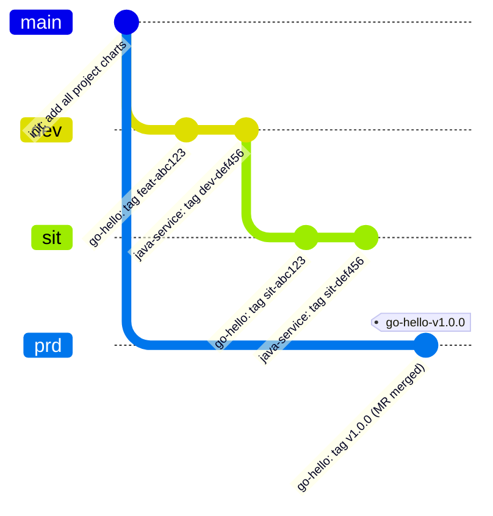
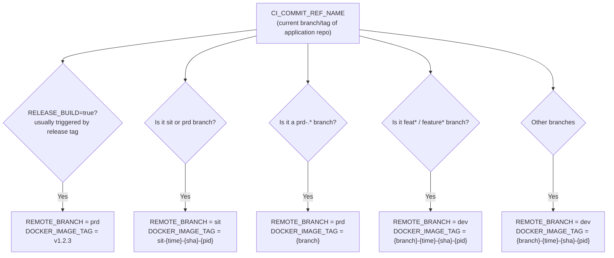
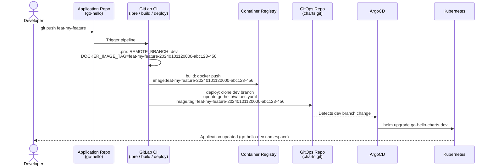
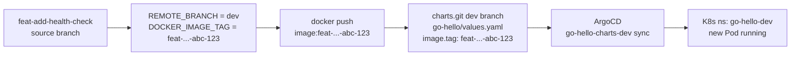
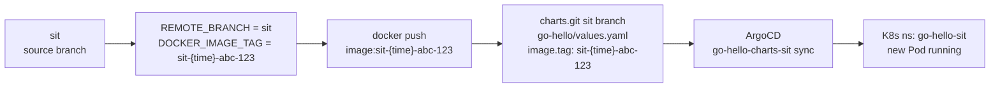
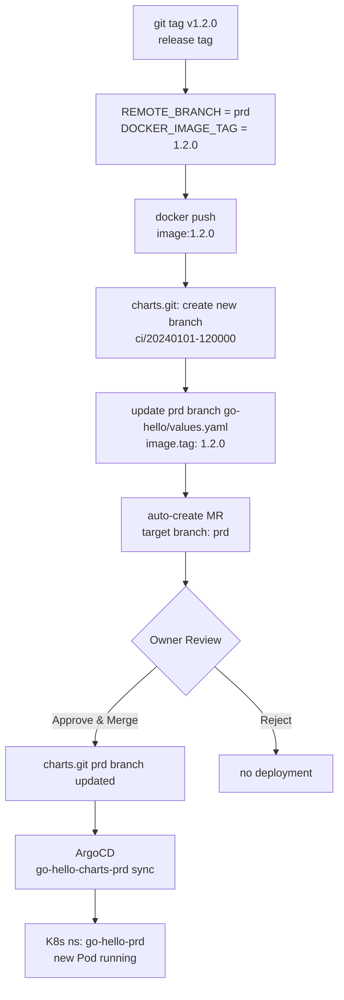
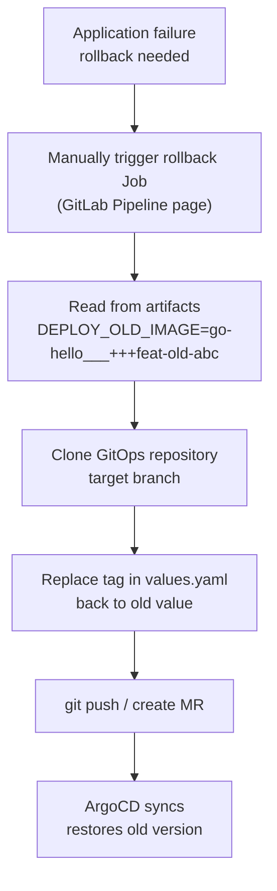

# Chapter 6: Multi-Project GitOps Repository Design and CD Integration

## Overview

This chapter addresses two core questions:

1. **How to manage multiple projects in a single GitOps repository**, using branches to separate environments
2. **How the CD stage integrates with the GitOps repository**, completing the full chain from CI image build to ArgoCD auto-deploy

> **Relationship to Chapter 3**: [Chapter 3](./03-gitops-repo-setup.md) demonstrates the model where each application has its own dedicated GitOps repository (suitable for projects that are fully independent and require separate access control). This chapter demonstrates the **single-repository multi-project** model (suitable for teams managing multiple services with unified governance). Both models can be chosen based on your needs. The core CD logic is the same; the main differences are in repository structure and ArgoCD Application naming.

## 1. Multi-Project GitOps Repository Design

### 1.1 Repository Structure: Folders Isolate Projects, Branches Isolate Environments

```
gitops/charts.git
│
├── go-hello/          ← Golang project
│   ├── Chart.yaml
│   ├── values.yaml    ← CI updates image.tag in this file
│   └── templates/
│       ├── deployment.yaml
│       └── service.yaml
│
├── java-service/      ← Java project
│   ├── Chart.yaml
│   ├── values.yaml
│   └── templates/
│
├── python-api/        ← Python project
│   ├── Chart.yaml
│   ├── values.yaml
│   └── templates/
│
└── nodejs-web/        ← Node.js project
    ├── Chart.yaml
    ├── values.yaml
    └── templates/
```

Each environment maps to a dedicated branch with the same file structure, but different `image.tag` values in `values.yaml`:



### 1.2 Branch-to-Environment Mapping

| GitOps Branch | K8s Environment | Namespace Convention | Update Method |
|--------------|-----------------|---------------------|---------------|
| `dev` | DEV | `{project}-dev` | CI pushes directly |
| `sit` | SIT | `{project}-sit` | CI pushes directly |
| `prd` | PRD | `{project}-prd` | CI creates MR, human approval required |

> The `prd` branch should be configured as a Protected Branch in GitLab, allowing merges only via MR.

### 1.3 REMOTE_BRANCH Auto-Derivation Rules

The CI template automatically derives `REMOTE_BRANCH` (the GitOps target branch) in the `.pre` stage based on the **application repo's source branch**:



> **Note**: The release tag path to `prd` (R1) depends on the variable `RELEASE_BUILD=true`. When pushing a release tag, you must configure `RELEASE_BUILD: "true"` in `.gitlab-ci.yml`; otherwise it falls back to `dev`.
>
> Use `CUSTOM_REMOTE_SIT_BRANCH` and `CUSTOM_REMOTE_PRD_BRANCH` to customize branch mappings.

## 2. ArgoCD Application Naming Convention

**This is critical for the entire solution to work correctly.** The CD script constructs the Application name when triggering ArgoCD sync using the following rule:

```
ArgoCD App Name = {DEPLOY_REPO_PROJ}-{GitOps_repo_name}-{REMOTE_BRANCH}
```

Where:
- `DEPLOY_REPO_PROJ`: the **project folder name** inside the GitOps repository (e.g., `go-hello`)
- `GitOps repo name`: the repository name extracted from the `DEPLOY_REPO` URL (`charts.git` → `charts`)
- `REMOTE_BRANCH`: the target environment branch (`dev` / `sit` / `prd`)

**Examples**:

| DEPLOY_REPO | DEPLOY_REPO_PROJ | REMOTE_BRANCH | ArgoCD App Name |
|------------|-----------------|---------------|-----------------|
| `.../gitops/charts.git` | `go-hello` | `dev` | `go-hello-charts-dev` |
| `.../gitops/charts.git` | `go-hello` | `sit` | `go-hello-charts-sit` |
| `.../gitops/charts.git` | `go-hello` | `prd` | `go-hello-charts-prd` |
| `.../gitops/charts.git` | `java-service` | `dev` | `java-service-charts-dev` |

**Therefore, ArgoCD Applications must be named strictly following this convention.**

### 2.1 Batch-Create Applications for All Environments

Using `go-hello` as an example, create Applications for all three environments on K3s:

```bash
CHARTS_REPO="https://gitlab.example.com/gitops/charts.git"
GITLAB_TOKEN="<YOUR_TOKEN>"
NODE_IP="10.16.110.17"

for ENV in dev sit prd; do
  kubectl create namespace "go-hello-${ENV}" --dry-run=client -o yaml | kubectl apply -f -

  argocd app create "go-hello-charts-${ENV}" \
    --repo "${CHARTS_REPO}" \
    --path go-hello \
    --revision "${ENV}" \
    --dest-server https://kubernetes.default.svc \
    --dest-namespace "go-hello-${ENV}" \
    --sync-policy automated \
    --auto-prune \
    --self-heal \
    --server "${NODE_IP}:30080"
done
```

## 3. Full Integration with the CD Stage

### 3.1 Data Flow Overview



> **DOCKER_IMAGE_TAG format**: `{branch}-{BUILD_TIME}-{CI_COMMIT_SHORT_SHA}-{CI_PIPELINE_ID}`
> `BUILD_TIME` is accurate to the minute (e.g., `20240101120000`), ensuring each build of the same branch produces a unique tag and prevents image overwrites.

### 3.2 CI Variable Reference

Configure the following variables in the application project's (go-hello) GitLab CI/CD Variables:

| Variable | Location | Example Value | Description |
|----------|----------|---------------|-------------|
| `DEPLOY_REPO` | Project Variables | `https://gitlab.example.com/gitops/charts.git` | GitOps repository URL |
| `DEPLOY_REPO_PROJ` | .gitlab-ci.yml or Variables | `go-hello` | Project folder name in GitOps repo |
| `DEPLOY_VALUE_FILE` | .gitlab-ci.yml | `values.yaml` | Values file to update |
| `DEPLOY_REPO_YAML_TAG` | .gitlab-ci.yml | `.image.tag` | yq path to the image tag field |
| `GITLAB_REPO_COMMIT_TOKEN` | Project Variables (Masked) | `glpat-xxxx` | Token with write access to GitOps repo |
| `ARGOCD_SERVER` | Group/Project Variables | `10.16.110.17:30080` | ArgoCD address (no https://) |
| `ARGOCD_AUTH_TOKEN` | Project Variables (Masked) | `xxxx` | ArgoCD API Token |
| `DEV_CD_AUTO_DEPLOY` | .gitlab-ci.yml | `"true"` | Auto-trigger CD for DEV environment |
| `SIT_CD_AUTO_DEPLOY` | .gitlab-ci.yml | `"true"` | Auto-trigger CD for SIT environment |
| `PRD_CD_AUTO_DEPLOY` | .gitlab-ci.yml | `"true"` | PRD environment (creates MR) |

> `GITLAB_REPO_COMMIT_TOKEN` and `ARGOCD_AUTH_TOKEN` are recommended at Group Variables level to share across all projects.

## 4. Golang Project End-to-End Example

### 4.1 Prerequisites

**Step 1: Confirm the GitOps repo has the required branches and directories**

```bash
cd /tmp/gitops-charts

# Ensure all three environment branches exist
git checkout dev    && ls go-hello/
git checkout sit    && ls go-hello/
git checkout prd    && ls go-hello/
```

**Step 2: Create ArgoCD Applications (first time only)**

```bash
# See batch creation command in section 2.1
argocd app list --server 10.16.110.17:30080 | grep go-hello
# go-hello-charts-dev   ...  Synced  Healthy
# go-hello-charts-sit   ...  Synced  Healthy
# go-hello-charts-prd   ...  Synced  Healthy
```

**Step 3: Configure .gitlab-ci.yml in the application repo**

```yaml
include:
  - remote: 'https://raw.githubusercontent.com/cdryzun/gitlab-ci-templates/open/templates/Auto-DevOps.gitlab-ci.yml'

variables:
  # Build
  BUILD_SHELL: "go mod tidy && go build -o ${CI_PROJECT_NAME} ./..."
  FEAT_DOCKER_IMAGE_BUILD: "true"
  UNIT_TEST_ENABLE: "true"

  # CD configuration (points to go-hello folder in charts repo)
  DEPLOY_REPO: "https://gitlab.example.com/gitops/charts.git"
  DEPLOY_REPO_PROJ: "go-hello"
  DEPLOY_VALUE_FILE: "values.yaml"
  DEPLOY_REPO_YAML_TAG: ".image.tag"

  # Per-environment CD switches
  DEV_CD_AUTO_DEPLOY: "true"
  SIT_CD_AUTO_DEPLOY: "true"
  PRD_CD_AUTO_DEPLOY: "true"
```

### 4.2 Per-Scenario Flow

#### Scenario A: Feature Development → DEV Deploy

```
git push origin feat-add-health-check
```



#### Scenario B: Integration Testing → SIT Deploy

```
git push origin sit
```



#### Scenario C: Release → PRD Deploy (MR Approval)

```
git tag v1.2.0 && git push origin v1.2.0
```



### 4.3 Getting the ARGOCD_AUTH_TOKEN

```bash
# Create a Service Account Token in ArgoCD
argocd account generate-token \
  --account pipeline \
  --server 10.16.110.17:30080

# Or create a dedicated account
argocd account update-password \
  --account pipeline \
  --new-password "<STRONG_PASSWORD>" \
  --server 10.16.110.17:30080

argocd account generate-token --account pipeline --server 10.16.110.17:30080
```

Store the generated token in GitLab CI/CD Variables (recommended at Group level to share across all projects).

## 5. Multi-Project values.yaml Structure Convention

All projects should use a unified `image` field structure in `values.yaml` to ensure the CI's `DEPLOY_REPO_YAML_TAG: ".image.tag"` works universally:

```yaml
# go-hello/values.yaml (dev branch)
replicaCount: 1

image:
  repository: registry.gitlab.example.com/sre/devops/go-hello
  pullPolicy: IfNotPresent
  tag: "feat-my-feature-20240101-abc123-456"  # <- CI auto-updates this field

service:
  type: ClusterIP
  port: 2025
```

If a project uses a different field path, override it with `DEPLOY_REPO_YAML_TAG`:

```yaml
# java-service: image is at .deployment.image.tag
DEPLOY_REPO_YAML_TAG: ".deployment.image.tag"
```

## 6. Rollback Flow

The CI pipeline saves the old tag to artifacts (`cd.env`) during the deploy stage, which is read back during rollback:



## Next Steps

- Configure GitLab Webhook for immediate ArgoCD sync (see [Chapter 4](./04-argocd-gitops-integration.md#5-configure-gitlab-webhook-optional-for-immediate-sync))
- Configure GitLab Branch Protection Rules and CODEOWNERS for the `prd` branch
