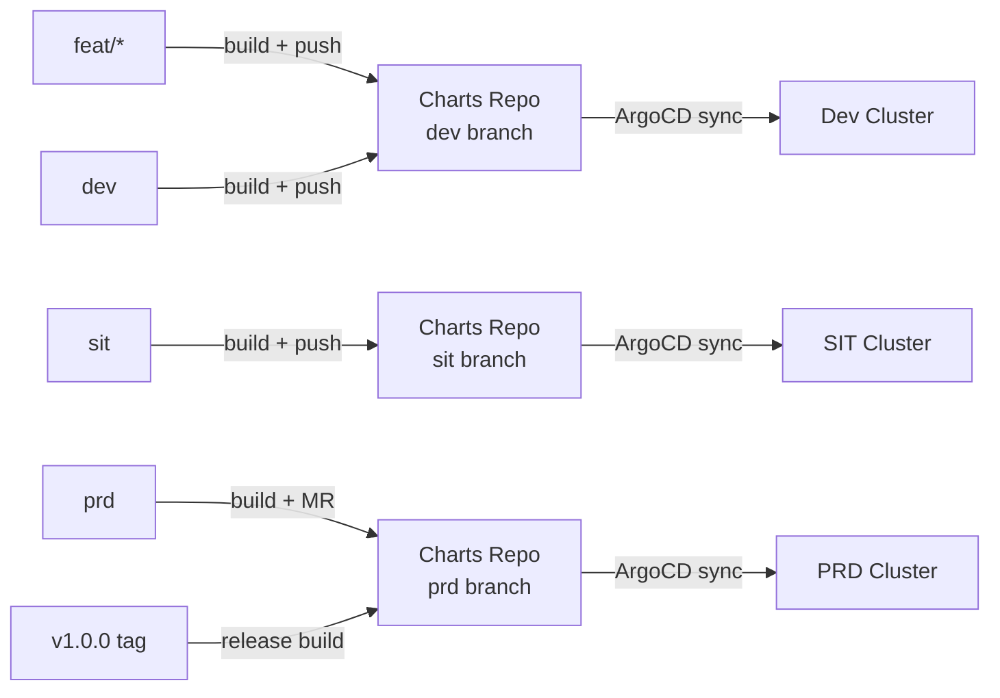
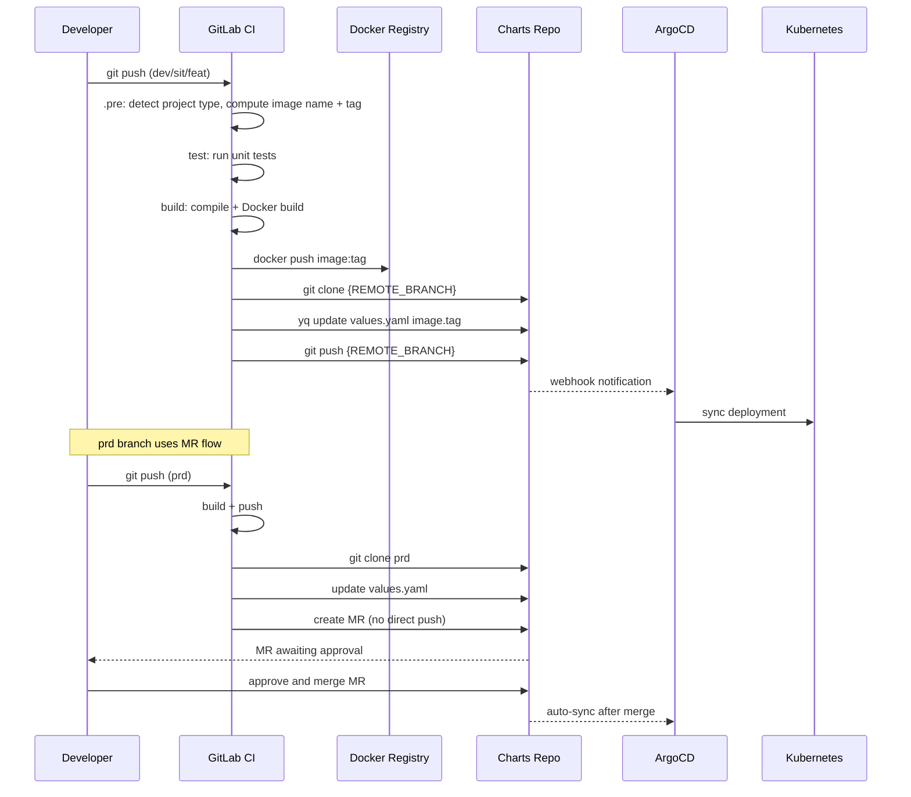

# Branching Workflow & Release Strategy

## Design Principle

One rule: **code branch determines deployment target. Git is the single source of truth.**

The template uses an Environment Branching model -- not Git Flow, not Trunk-Based. Why:

- GitLab's protected branch + MR approval covers production gates natively
- ArgoCD's `targetRevision` tracks one branch per environment -- simplest config possible
- Rollback is `git revert` on a commit. No extra mechanisms needed.

## Branch-to-Environment Mapping



| Source Branch | Charts Branch | Docker Tag Format | Deploy Behavior |
|---|---|---|---|
| `feat/*` / `feature/*` | `dev` | `feat-xxx-{time}-{sha}-{pipeline}` | Requires `FEAT_CD_AUTO_DEPLOY=true` |
| `dev` | `dev` | `dev-{time}-{sha}-{pipeline}` | Auto-deploy |
| `sit` | `sit` | `sit-{time}-{sha}-{pipeline}` | Auto-deploy |
| `prd` | `prd` | `prd-{time}-{sha}-{pipeline}` | Creates MR for approval |
| `v*.*.*` (tag) | `prd` | `1.0.0` (v prefix stripped) | Release build, direct push |
| `prd-{tag}` | `prd` | `prd-{tag}` | Tag-based rollback scenario |

## Full Pipeline Flow



## Git Tags & Releases

### Automatic Tag Creation

When `PRD_BUILD_CREATE_TAG=true` (on by default), each prd branch build:

1. Creates a GitLab Release + Tag (named after the Docker Image Tag)
2. Generates a changelog with trigger user, timestamp, branch
3. Links to Charts repo if `DEPLOY_REPO` is configured
4. Cleans up old Tags, keeping the latest N (controlled by `PRD_CD_CREATE_TAG_NUM`, default 20)

### Release Builds (Semantic Versioning)

Push a `v*.*.*` Git tag:

```bash
git tag v1.0.0
git push origin v1.0.0
```

The template recognizes this as a Release build:
- `RELEASE_BUILD=true`
- Docker tag strips the `v` prefix: `my-service:1.0.0`
- Deploy target: `prd` branch

### Image ReTag (Skip Rebuild)

When `RELEASE_RETAG_DISABLE` is not `true`, Release builds look for an existing image to ReTag instead of rebuilding. Saves time and guarantees the production image is identical to what was tested.

## PRD Branch: MR Approval

When `REMOTE_BRANCH == 'prd'`, CI does not push directly to the Charts repo prd branch. Instead:

1. Checks out a timestamped branch from prd
2. Finds all Owner-level users in the Charts repo as reviewers
3. Creates an MR targeting prd with `--remove-source-branch`
4. Waits for manual approval and merge

Production changes always go through review. CI cannot bypass this.

## Rollback Strategies

### Option 1: Built-in CD Rollback Job

The pipeline includes a `cd-rollback` job (manual trigger):

1. Reads the previous image tag from `cd.env` (saved during deploy)
2. Overwrites the current tag in the Charts repo values file
3. Pushes the change, ArgoCD syncs back to the old version

### Option 2: Git Revert (Recommended)

Revert the latest commit on the corresponding Charts branch:

```bash
cd charts-repo
git revert HEAD
git push origin dev  # or sit / prd
```

ArgoCD detects the change and rolls back. Clean Git history.

### Option 3: ArgoCD Manual Rollback

In the ArgoCD UI, select a previous revision and click Rollback. Best for emergencies.

## Configuration Variables

| Variable | Default | Description |
|---|---|---|
| `DEPLOY_REPO` | -- | Charts repo Git URL (required to enable CD) |
| `DEPLOY_VALUE_FILE` | `values.yaml` | YAML file(s) to update, comma-separated |
| `DEPLOY_REPO_YAML_TAG` | `.image.tag` | yq path to the field to update |
| `DEPLOY_REPO_PROJ` | `${CI_PROJECT_NAME}` | Project directory name in the Charts repo |
| `REMOTE_BRANCH` | auto | Charts repo target branch (dev/sit/prd) |
| `CUSTOM_REMOTE_SIT_BRANCH` | -- | Override Charts target branch for sit |
| `CUSTOM_REMOTE_PRD_BRANCH` | -- | Override Charts target branch for prd |
| `FEAT_CD_AUTO_DEPLOY` | `false` | Auto-deploy on feat branches |
| `DEV_CD_AUTO_DEPLOY` | `true` | Auto-deploy on dev branch |
| `SIT_CD_AUTO_DEPLOY` | `true` | Auto-deploy on sit branch |
| `PRD_CD_AUTO_DEPLOY` | `true` | Auto-deploy on prd branch (via MR) |
| `PRD_BUILD_CREATE_TAG` | `true` | Create Release Tag after prd build |
| `PRD_CD_CREATE_TAG_NUM` | `20` | Max Release Tags to keep |
| `RELEASE_BUILD` | `false` | Release mode (auto-set by v*.*.* tags) |
| `RELEASE_RETAG_DISABLE` | `false` | Force rebuild instead of ReTag |
| `DEPLOY_COMMIT_MESSAGE` | `chore: helm values updated...` | CI auto-commit message |
| `GIT_AUTO_COMMIT_NAME` | `ci-bot` | Git username for CI commits |
| `GIT_AUTO_COMMIT_EMAIL` | `ci-bot@example.com` | Git email for CI commits |
