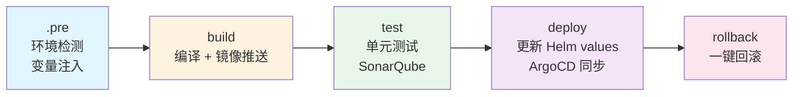

---
hide:
  - navigation
---

# gitlab-ci-templates

**6 行 YAML，获得生产级 CI/CD 流水线。**

自动识别 Java、Node.js、Python、Golang 项目类型，内置 Docker 构建、SonarQube 扫描、ArgoCD GitOps 部署和一键回滚。

```yaml
include:
  - remote: 'https://raw.githubusercontent.com/cdryzun/gitlab-ci-templates/open/templates/Auto-DevOps.gitlab-ci.yml'
```

推送代码，流水线自动触发。就这么简单。

## 流水线架构



## 支持的语言和框架

| 类别 | 框架 | 配置量 |
|------|------|--------|
| Java | Maven, Gradle, Spring Boot | 3 行 |
| 前端 | React, Vue, Angular, Next.js | 3 行 |
| Node.js 后端 | Express, Koa, Nest.js | 8 行（需自定义 Dockerfile） |
| Python | Flask, Django, FastAPI | 0 行（零配置） |
| Golang | Gin, Echo, 标准库 | 0 行（零配置） |
| 混合 | Golang + Node.js（go:embed） | 4 行 |

## 快速开始

[:material-rocket-launch: 30 秒接入](guide/quickstart.md){ .md-button .md-button--primary }
[:material-file-document: 变量参考](reference/variables.md){ .md-button }
[:material-github: GitHub](https://github.com/cdryzun/gitlab-ci-templates){ .md-button }
